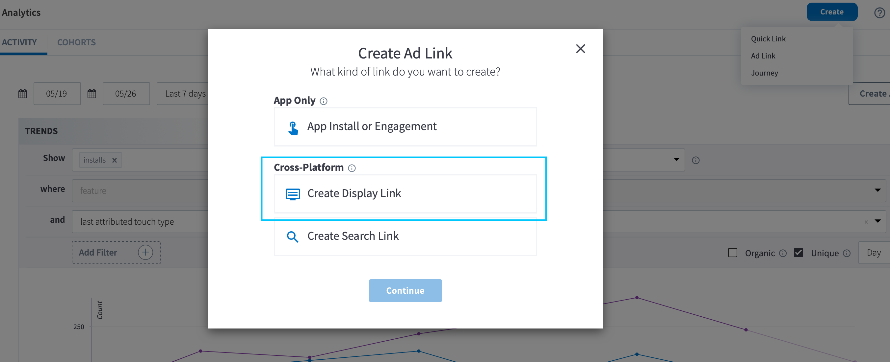
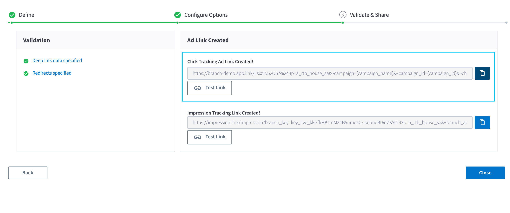

# Overview

This software convert any tab or comma separated compatible product feed to a Branch compatible product feed.

# Setup

Install Homebrew

Run `brew install node`

Install serverless `npm -g install serverless`
Install typescript `npm install -g typescript`

Then run `npm install` from the root folder to install dependencies

Test by running `serverless --help`

Note: You may need to install Docker for deployment to work if you have not installed it already. The simplest is to install Docker Desktop: https://docs.docker.com/install/

Run `npm run install` to configure your serverless environment (note you may need to add your AWS Access Key ID and Secret to the package.json setup script)

## Enabling product feeds per partner

First ensure you have enabled the ad partner you will like to generate the feed for on the Branch dashboard: https://help.branch.io/using-branch/docs/universal-ads-integration-guide

After enabling the ads partner, create a Crossplatform display link for the partner - it's important that this link not have any values configured on it:

Create the link:


Copy the link:


Your link should look something similar to below except it will have your own Branch link domain:
`https://branch-demo.app.link/LXxzTv52O6?%243p=a_rtb_house_sa&~campaign={campaign_name}&~campaign_id={campaign_id}&~channel={channel}&~click_id={click_id}&~cost_currency={cost_currency}&~cost_value={cost_value}&~secondary_publisher={publisher}`

Open the `FeedConfig.json` file from the `src/mappings` folder and configure the ad partner in the `ad_partners` section of the configuration:

```
{
  "name": "rtb_house",
  "template": "https://branch-demo.app.link/LXxzTv52O6?%243p=a_rtb_house_sa&~campaign={campaign_name}&~campaign_id={campaign_id}&~channel={channel}&~click_id={click_id}&~cost_currency={cost_currency}&~cost_value={cost_value}&~secondary_publisher={publisher}",
  "destinationKey": "rtb_house-products.csv"
}
```

Specify in the `FeedConfig.json` the name of the column in your feed that is the `link` under the `link_key` property.

You can choose to remap particular columns in the feed under the `mappings` section: e.g. setting any images as the `og_image` etc.

# AWS Setup

If you don't already have an AWS account visit: https://aws.amazon.com to create one.

Next create an IAM User with programmatic access and the following policy permissions:

- SecretsManagerReadWrite
- AWSLambdaFullAccess
- AmazonDynamoDBFullAccess
- AmazonAPIGatewayAdministrator
- AWSCodeDeployRoleForLambda
- AWSDeepRacerCloudFormationAccessPolicy
- IAMFullAccess

Save the AWS key and secret for later use

Install the AWS CLI: https://docs.aws.amazon.com/cli/latest/userguide/cli-chap-install.html

*Note:* if you already have the AWS CLI installed make sure the credentials in the `~/.aws/credentials` file match the use you just created above.

# Deployment & Updating

Run `sls deploy`